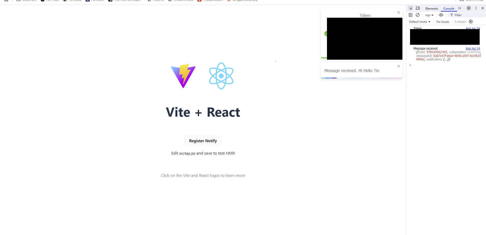

# Firebase Cloud Message Demo

## Development

### Frontend

Vite+ React

Initial Script

```
cd frontend
npm i
```

Run

```
npm run dev
```

### Backend

Node.js Express

Initial Script

```
cd backend
npm i
```

Run

```
npm run dev
```

## Initial Firebase Cloud Message

- Create Firebase Account and Go to firebase console
- New Web App
- See the Official Docs at https://firebase.google.com/docs/cloud-messaging/js/client
  

### Frontend

- Create the Credential file in `frontend/config` from `credential.example.js` to `credential.js` and put the config from your firebase console in it.
- Create file `public/firebase-messaging-sw.js` from `public/firebase-messaging-sw.example.js`
- Create file `.env` from `.env.example` (When you import with vite use `import.meta.env.VITE_` in create-react-app use `process.env.REACT_APP_`)
- Get the Vapid Key from your public key and keep in .env file
  
  
- On Frontend Focus on Recieve a message
- Main Logic is on `App.jsx` and `public/firebase-messaging-sw.js`

- Firebase Notify is both on Foreground and Backgroud for the foregroud in App.jsx backgroud is in service worker

### Backend

- In firebase console, go to setting > Service account
  and download your service account file
  
- Save file to backend and named the file `serviceAccount.json`
- For Document visit https://firebase.google.com/docs/cloud-messaging/send-message

### How To Test

- After Setting Run the program
- Click Register Notify in frontend and wait for token
- Create a post request to `http://localhost:3001/api/test` with JSON style body

```
{
    "token":"notify token from frontend console or toast after",
    "message":"Hiiii"
}
```

can send by postman, apidog or another client

- Watching for the result

The final Result will be like



---

&copy; 2025, Intelligent Automation Engineering Center
